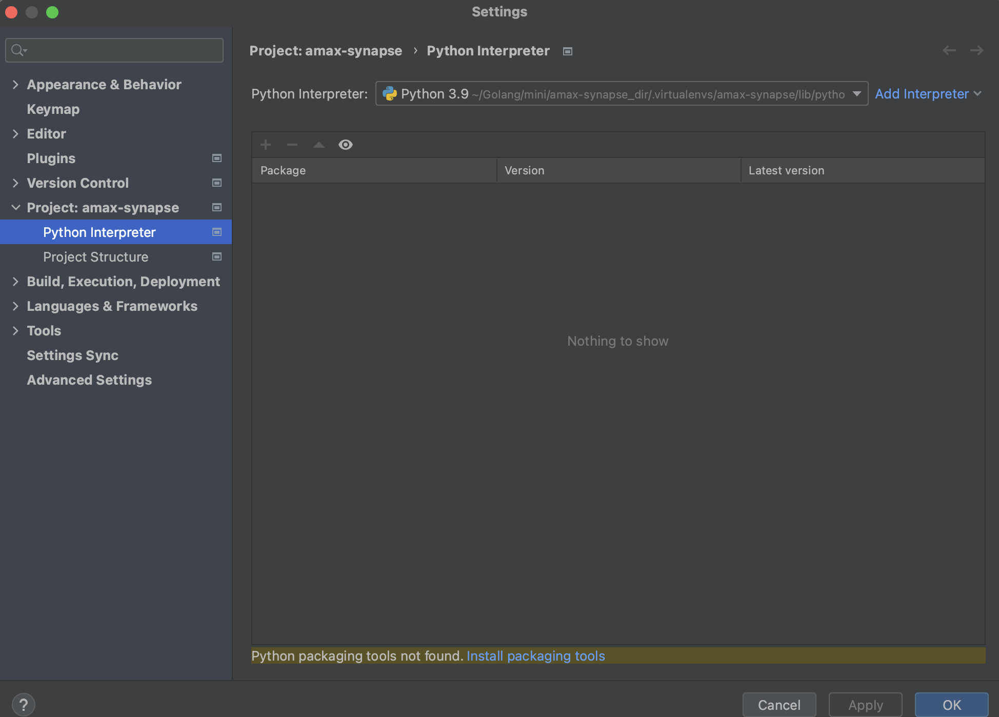
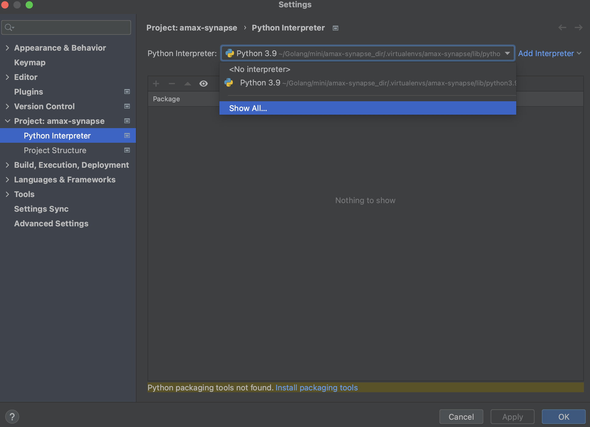
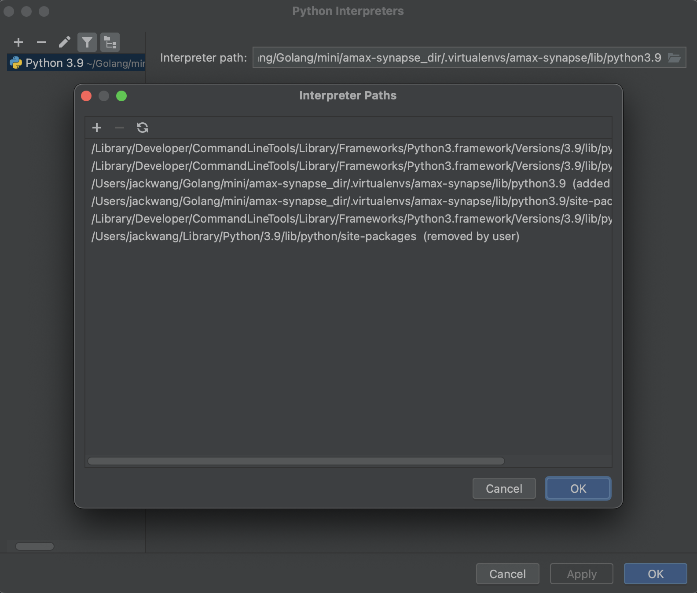
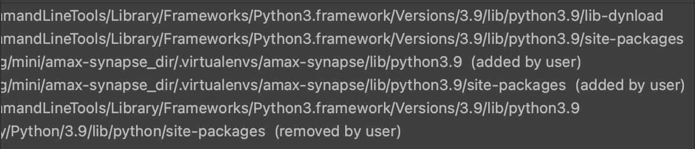
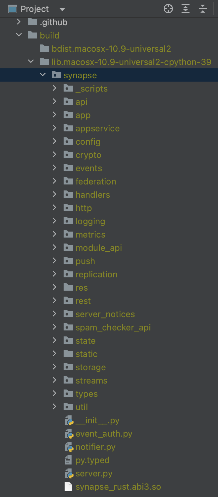
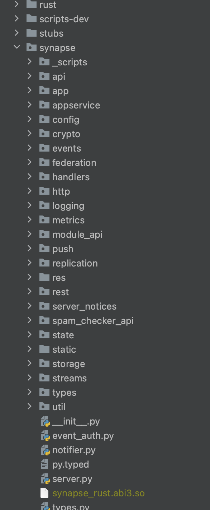
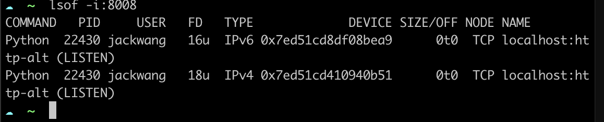

# amax-synapse 安装文档

## 第一阶段

* 准备vpn

* 创建虚拟环境

        python3 -m venv  .virtualenvs/amax-synapse

* 激活虚拟环境

        source .virtualenvs/amax-synapse/bin/activate

* 进入项目

        cd amax-synapse

* 安装rustup

        curl --proto '=https' --tlsv1.2 -sSf https://sh.rustup.rs | sh

* 查看cargo —version 和 rustup —version

        cargo —version
        rustup —version

* 安装poetry

        brew install poetry

* 删除poetry.lock

       rm poetry.lock

*  安装pyproject.toml

        poetry install 

* 等待很长时间 rust 编译ing …. success  

* 安装依赖

        pip install .


## 第二阶段

* 更新pycharm external libraries

    
    
    
    

    1.上面“added by user” 是我们pyproject.toml 编译的依赖库，需要添加到我们的项目中去
    2.添加完成之后 重启pymchar IDE
    3.此时项目中绝大部依赖库不报错了*

* 在项目中查看 build ->synapse-> synapse_rust.abi.so 如下图

    

* 复制build->synapse->synapse_rust.abi3.so 到 项目synapse目录下

    

        这个时候synapse.synapse_rust 报错，不管用，因为上面有了扩展文件,运行的时候是正常的


* 创建配置文件

        python -m synapse.app.homeserver \
        --server-name matrix.ambt.art \
        --config-path homeserver.yaml \
        --generate-config \
        --report-stats=yes

* 编辑homeserver.yaml

    ```
    # Configuration file for Synapse.
    #
    # This is a YAML file: see [1] for a quick introduction. Note in particular
    # that *indentation is important*: all the elements of a list or dictionary
    # should have the same indentation.
    #
    # [1] https://docs.ansible.com/ansible/latest/reference_appendices/YAMLSyntax.html
    #
    # For more information on how to configure Synapse, including a complete accounting of
    # each option, go to docs/usage/configuration/config_documentation.md or
    # https://matrix-org.github.io/synapse/latest/usage/configuration/config_documentation.html
    server_name: "matrix.ambt.art"
    amax_rpc_url: https://testnode.amaxscan.io/
    wallet_sigin_message: "Welcome to amax-synapse!"
    # When running as a daemon, the file to store the pid in
    #
    amax:
    chain_id: "208dacab3cd2e181c86841613cf05d9c60786c677e4ce86b266d0a58884968f7"
    signature_url: "https://storage.ambt.art/api/v1/signature_verify"

    pid_file: /Users/jackwang/Golang/mini/amax-synapse_dir/amax-synapse/homeserver.pid

    disable_msisdn_registration: true
    #registration_requires_token: true
    enable_registration_without_verification: true
    allow_guest_access: true
    #registrations_require_3pid:
    #   - email

    listeners:
    - port: 8008
        tls: false
        type: http
        x_forwarded: false
        bind_addresses: ['::1', '127.0.0.1']
        resources:
        - names: [client, federation]
            compress: false


    database:
    name: psycopg2
    args:
        user: postgres
        password: 123456
        database: synapse
        host: 127.0.0.1
        port: 5432
        cp_min: 5
        cp_max: 50

    redis:
    enabled: true
    host: 192.168.0.38
    port: 6379
    password:


    log_config: "/Users/jackwang/Golang/mini/amax-synapse_dir/amax-synapse/matrix.ambt.art.log.config"
    media_store_path: /Users/jackwang/Golang/mini/amax-synapse_dir/amax-synapse/media_store
    registration_shared_secret: "YOmuzX:eW3#I7i:dr&x^w56E66q^vQQH+0s41fucmBFmfqKapX"
    report_stats: false
    macaroon_secret_key: "1QdvAYauZeH=UhN*T,dyngy^x@m3xS1h7I4rR~GCz07dlBn01l"
    form_secret: "hqfMm+z.S&2SP@nFzP_mSnC4nbyJNaQR8,h-,=b#6:OAP:=9w^"
    signing_key_path: "/Users/jackwang/Golang/mini/amax-synapse_dir/amax-synapse/matrix.ambt.art.signing.key"
    trusted_key_servers:
    - server_name: "matrix.org"

    #copy dev config
    user_directory:
    prefer_local_users: true

    event_cache_size: 15K
    run_background_tasks_on: background_worker
    instance_map:
    synapse-replication:
        host: synapse-replication
        port: 8008
    synapse-presence:
        host: synapse-presence
        port: 8008

    stream_writers:
    events: synapse-replication
    presence: synapse-presence

    opentracing:
    enabled: false
    homeserver_whitelist:
        - "jaeger.ambt.art"
        - "jaeger"
    jaeger_config:
        sampler:
        type: const
        param: 1
        local_agent:
        reporting_host: "jaeger"
        reporting_port': 6831
        logging:
        false
    federation_domain_whitelist:
    - matrix.ambt.art

    caches:
    global_factor: 1.0
    per_cache_factors:
        get_users_who_share_room_with_user: 2.0
    sync_response_cache_duration: 2m
    cache_autotuning:
        max_cache_memory_usage: 1024M
        target_cache_memory_usage: 758M
        min_cache_ttl: 5m

    retention:
    enabled: true
    default_policy:
        min_lifetime: 1d
        max_lifetime: 1w
    allowed_lifetime_min: 1d
    allowed_lifetime_max: 1w
    purge_jobs:
    - longest_max_lifetime: 3d
        interval: 12h
    - shortest_max_lifetime: 3d
        longest_max_lifetime: 1w
        interval: 1d
    - shortest_max_lifetime: 1w
        interval: 2d
    ```

* 安装redis  postgresql

        docker redis + postgresql

* 在postgresq 数据库中创建synapse database

        CREATE DATABASE synapse
        WITH OWNER = postgres
            ENCODING = 'UTF8'
            LC_COLLATE = 'C'
            LC_CTYPE = 'C'
            TEMPLATE = template0;

* 如果有下面2个错误

        ERROR:root:Synapse 1.74.0 needs txredisapi for redis, but it is not installed
        ERROR:root:Synapse 1.74.0 needs hiredis for redis, but it is not installed
        
        pip install txredisapi hiredis

* synapse 启动和暂停

        Synctl start 启动 
        Synctl stop  暂停

* 查看端口正常

        lsof -i:8008  


    

* url

         http://localhost:8008